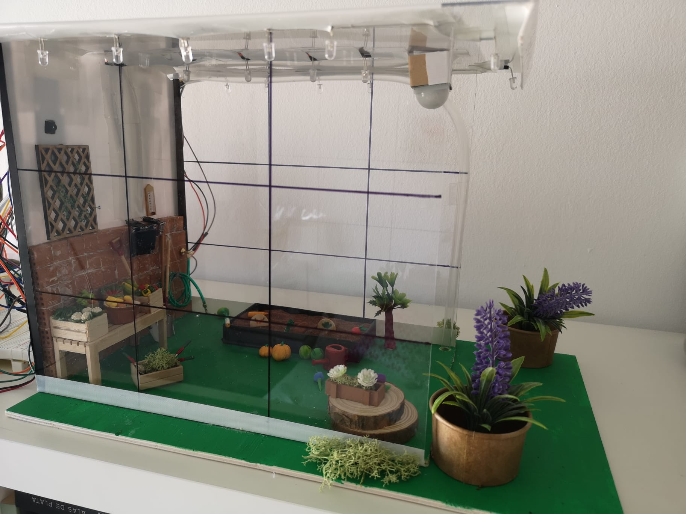
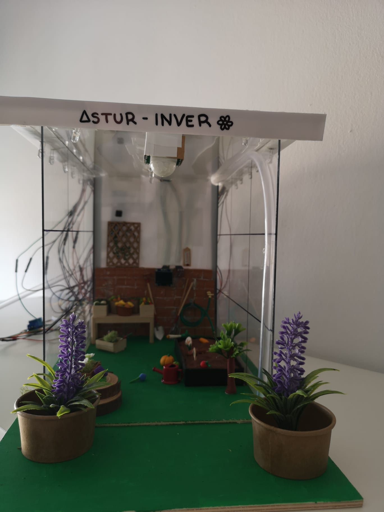

# Proyecto final
###### Andrea Muñiz
<p></p>

## Objetivo

El objetivo de este proyecto es crear un invernadero domótico con varias funciones para su vigilancia y utilización ya sea cultivando verduras o flores. Todo ello implementado mediante dos placas ESP-32 y una placa ESP32-CAM.

***

## Funciones

Las funciones utilizadas por el invernadero son: 
- _Cámara de vigilancia_: con ella se puede vigilar mediante una IP lo que está sucediendo aún sin estar cerca del invernadero.
- _Sensor de movimiento + leds_: Con este sensor se controlan las luces del interior, de forma que solo funcionen cuando haya alguien en el invernadero, siendo así más económicas ya que no se utilizarían si no se necesitan.
- _Sensor de luz + leds_: Al igual que el sensor anterior, este sensor controla las luces exteriores, de esta forma, cuando detecta un cierto grado de oscuridad, encendería los leds exteriores simulando que el invernadero no se encontraría en una zona con mucha iluminación como podría ser el campo.
- _Sensor de temperatura_: Este sensor posee dos funciones interesantes para el proyecto. Por un lado, se utiliza para que, mediante un display, se pueda conocer la temperatura interna, desde el exterior, y podría implementarse un ventilador que, en caso de que la temperatura fuese demasiado alta para las verduras plantadas, se activase introduciendo aire más fresco del exterior. Por otro lado, también mide la humedad, por lo que esta función es utilizada para generar un riego automático el cual cuando detecta que hay menos humedad de la requerida en el invernadero se activa un relé que a su vez activa una bomba de agua la cual está conectada a una pequeña manguera y ésta conduce el agua hasta la zona requerida.

***

## Programas y explicación

### Cámara de vigilancia

> Incluimos las librerias necesarias

```
#include <Arduino.h>
#include "esp_camera.h"
#include <WiFi.h>
#include "camera_pins.h"
```

> Definimos el tipo de cámara

```
#define CAMERA_MODEL_AI_THINKER
```

> Declaramos la información necesaria para conectartos a la red WiFi.

```
const char* ssid = "MOVISTAR_5637";
const char* password = "hieNwj9vNcxHTRAjPpvh";
```

> Función __startCameraServer()__

Esta función está definida en una de las bibliotecas, por lo que no hay que implementarla. Dicha función sirve para inicializar la cámara.

```
void startCameraServer();
```

> Función __setup()__

Esta función inicializa el serial a 115200. A continuación, configura los pines internos de la cámara necesarios y configura la imagen que veremos mediante la IP generada. Configuramos también los errores por si no funcionase, que podamos saber el porqué. Por último configuramos la conexión con la red WiFi, para ello le pasamos el usuario y la contraseña de nuestro router declarados con anterioridad, mientras la placa se esté conectando con la red, se escriben por el monitor puntos. Una vez conectado, se informa por el monitor y se genera la IP que utilizaremos para poder ver las imágenes que capta la cámara.

```
void setup() {
  Serial.begin(115200);
  Serial.setDebugOutput(true);
  Serial.println();

  camera_config_t config;
  config.ledc_channel = LEDC_CHANNEL_0;
  config.ledc_timer = LEDC_TIMER_0;
  config.pin_d0 = Y2_GPIO_NUM;
  config.pin_d1 = Y3_GPIO_NUM;
  config.pin_d2 = Y4_GPIO_NUM;
  config.pin_d3 = Y5_GPIO_NUM;
  config.pin_d4 = Y6_GPIO_NUM;
  config.pin_d5 = Y7_GPIO_NUM;
  config.pin_d6 = Y8_GPIO_NUM;
  config.pin_d7 = Y9_GPIO_NUM;
  config.pin_xclk = XCLK_GPIO_NUM;
  config.pin_pclk = PCLK_GPIO_NUM;
  config.pin_vsync = VSYNC_GPIO_NUM;
  config.pin_href = HREF_GPIO_NUM;
  config.pin_sscb_sda = SIOD_GPIO_NUM;
  config.pin_sscb_scl = SIOC_GPIO_NUM;
  config.pin_pwdn = PWDN_GPIO_NUM;
  config.pin_reset = RESET_GPIO_NUM;
  config.xclk_freq_hz = 20000000;
  config.pixel_format = PIXFORMAT_JPEG;
  
  if(psramFound()){
    config.frame_size = FRAMESIZE_UXGA;
    config.jpeg_quality = 10;
    config.fb_count = 2;
  } else {
    config.frame_size = FRAMESIZE_SVGA;
    config.jpeg_quality = 12;
    config.fb_count = 1;
  }

#if defined(CAMERA_MODEL_ESP_EYE)
  pinMode(13, INPUT_PULLUP);
  pinMode(14, INPUT_PULLUP);
#endif

  esp_err_t err = esp_camera_init(&config);
  if (err != ESP_OK) {
    Serial.printf("Camera init failed with error 0x%x", err);
    return;
  }

  sensor_t * s = esp_camera_sensor_get();
  
  if (s->id.PID == OV3660_PID) {
    s->set_vflip(s, 1);
    s->set_brightness(s, 1);
    s->set_saturation(s, -2);
  }
  
  s->set_framesize(s, FRAMESIZE_QVGA);

#if defined(CAMERA_MODEL_M5STACK_WIDE) || defined(CAMERA_MODEL_M5STACK_ESP32CAM)
  s->set_vflip(s, 1);
  s->set_hmirror(s, 1);
#endif

  WiFi.begin(ssid, password);

  while (WiFi.status() != WL_CONNECTED) {
    delay(500);
    Serial.print(".");
  }
  Serial.println("");
  Serial.println("WiFi connected");

  startCameraServer();

  Serial.print("Camera Ready! Use 'http://");
  Serial.print(WiFi.localIP());
  Serial.println("' to connect");
}
```

> Función __bucle__

Esta función solo la utilizamos para esperar 10 segundos cuando se termina de "leer" todo el programa.

```
void loop() {
  delay(10000);
}
```

### Sensor de movimiento

> Declaramos las librerias necesarias y definimos el tiempo que queremos que las luces estén encendidas hasta que vuelva a detectar movimiento.

```
#include <Arduino.h>
#define timeSeconds 10
```
> Definimos los pines correspondientes a donde están conectados los leds y el sensor en la placa.

```
const int led = 18;
const int motionSensor = 27;
```

> Definimos algunas variables necesarias

```
unsigned long now = millis();
unsigned long lastTrigger = 0;
boolean startTimer = false;
```

> Función __IRAM_ATTR detectsMovement()__

Esta función comprueba su el movimiento ha sido detectado y escribe por el monitor _MOTION DETECTED!!!_, pone el led en high, o lo que es lo mismo, se encienden y comienza un contador que mide el tiempo que pasa.

```
void IRAM_ATTR detectsMovement() {
  Serial.println("MOTION DETECTED!!!");
  digitalWrite(led, HIGH);
  startTimer = true;
  lastTrigger = millis();
}
```

> Función __setup()__

Esta función inicializa el serial a 115200, se pone el sensor de movimiento en INPUT_PULLUP y se configura el pin del sensor como interrupción y se pone en modo RISING. Por último, se configura el led como salida OUTPUT y se apaga.

```
void setup() {
  // Serial port for debugging purposes
  Serial.begin(115200);
  
  pinMode(motionSensor, INPUT_PULLUP);
  attachInterrupt(digitalPinToInterrupt(motionSensor), detectsMovement, RISING);

  // Set LED to LOW
  pinMode(led, OUTPUT);
  digitalWrite(led, LOW);
}
```

> Función __bucle__

Esta función se encarga de, a partir del momento actual, si la hora actual menos la hora en que se encendieron los leds es mayor que el tiempo que definimos para que estén activos los leds, entonces apagamos los leds e informemaos por el monitor.

```
void loop() {
  now = millis();
  if(startTimer && (now - lastTrigger > (timeSeconds*1000))) {
    Serial.println("Motion stopped...");
    digitalWrite(led, LOW);
    startTimer = false;
  }
}
```

### Sensor de luz

> Incluimos las librerias necesarias

```
#include <Arduino.h>
```

> Declaramos los pines de la placa ESP-32 donde irán conectados los leds y el sensor de luz. Por cada pin utilizado en la placa, se conectan cuatro leds.

```
const int led = 2;
const int led2 = 19;
const int led3 = 15;
const int sens = 5;
int valor_sens = 0;
```

> Función __setup()__

Inicializamos el serial a una velocidad de 115200 y definimos los pines de los leds como salidas y el del sensor como entrada.

```
void setup() {
  Serial.begin (115200);
  pinMode(led, OUTPUT);
  pinMode(led2, OUTPUT);
  pinMode(led3, OUTPUT);
  pinMode (sens, INPUT);
}
```

> Función __bucle__

Leemos el valor del sensor, si detecta luz, es decir, que está en LOW, los leds también están apagados. En caso contrario se encienden los leds.

```
void loop() {
  valor_sens = digitalRead(sens);
  if(valor_sens == LOW){
    digitalWrite(led, LOW);
    digitalWrite(led2, LOW);
    digitalWrite(led3, LOW);
  }
  else {
    digitalWrite(led, HIGH);
    digitalWrite(led2, HIGH);
    digitalWrite(led3, HIGH);
  }
}
```

### Sensor de temperatura y humedad

> Declaramos las librerias

```
#include <Arduino.h>
#include <Wire.h>
#include <Adafruit_SSD1306.h>
#include <Adafruit_Sensor.h>
#include <Adafruit_GFX.h>
#include <Adafruit_BME280.h>
#include <Adafruit_I2CDevice.h>
```

> Definimos los pines en los que se conectan los pines SDA y SCL del sensor a la placa

```
#define I2C_SDA 21
#define I2C_SCL 22
```

> Definimos el nivel normal de presión y las medidas del display al que deberemos adaptar el tamaño de lo mostrado por él.

```
#define SEALEVELPRESSURE_HPA (1013.25)
#define SCREEN_WIDTH 128
#define SCREEN_HEIGHT 64
#define OLED_RESET    -1
```

> Definimos una variable con la que le daremos nombre al sensor y le pasamos a la variable del display los datos del mismo.

```
TwoWire I2CBME = TwoWire(0);
Adafruit_BME280 bme;
Adafruit_SSD1306 display(SCREEN_WIDTH, SCREEN_HEIGHT, &Wire, OLED_RESET);
```

> Declaramos una constante que sea el pin al que está conectado el relé que controlará la bomba

```
unsigned long delayTime;
const int pinBomba = 5;
```

> Función __setup()__

Definimos el pin del relé como salida, la velocidad del serial a 115200 y escribimos por pantalla "BME Test". Creamos un bucle _if_ en el cual, si el sensor no se detecta se informa por pantalla como error.

```
void setup() {
  pinMode(pinBomba, OUTPUT);
  Serial.begin(115200);
  display.begin(SSD1306_SWITCHCAPVCC, 0x3C);
  display.display();
  delay(3000);
  Serial.println(F("BME280 test"));
  I2CBME.begin(I2C_SDA, I2C_SCL, 100000);

  bool status;
  status = bme.begin(0x76, &I2CBME); 

  if (!status) {
      Serial.println("No se ha encontrado un sensor BME280 válido.");
      while (1);
    }

    Serial.println("-- Default Test --");
    delayTime = 1000;

    Serial.println();
}
```

> Función __buble__

Primero limpiamos la pantalla por si pudiera haber algo escrito aún en ella, después configuramos el color, la posición y el tamaño de las letras con las que escribiremos "TEMP" y la temperatura detectada. Por otro lado para el uso del riego automático creamos un bucle _if_ en el cual, si la humedad detectada es menos o igual a un porcentaje de humedad especificado, el relé se detecta activando la bomba de agua durante cinco segundos, a continuación espera dos segundos para ver si la humedad ha aumentado, en caso de que la humedad siga siendo menor a la especificada, se vuelve a actival el relé y la bomba de agua, en caso contrario se apaga el conjunto y se espera dos segundos para volver a analizar si la humedad es la adecuada.

```
void loop() { 

  display.clearDisplay();
  display.setTextSize(2);
  display.setTextColor(WHITE);
  display.setCursor(0, 0);
  display.println("  T E M P");
  display.setTextSize(2);
  display.setTextColor(WHITE);
  display.setCursor(0, 32);
  display.print(bme.readTemperature());
  display.print(" C");
  display.display();

  if(bme.readHumidity() <= 40){
    digitalWrite(pinBomba, HIGH);
    delay(5000);
    digitalWrite(pinBomba, LOW);
    delay(2000); 
  }
  else 
    digitalWrite(pinBomba, LOW);
    delay(2000);
}
```

***

## Observaciones

En la idea inicial del invernadero domótico también estaba la idea de que todo fuese alimentado por placas solares, pero debido a varios factores, entre ellos la complejidad que conlleva su montaje y programación, no ha podido ser posible su implementación. A pesar de su ausencia, a mi parecer, el invernadero está bastante completo y tiene bastantes funciones.

***

## Imágenes de la estructura


